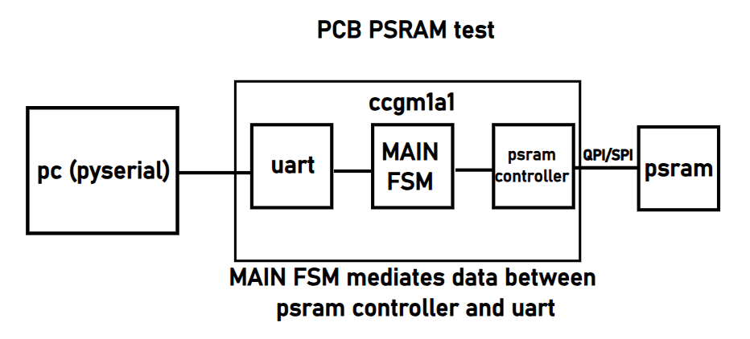

# openCologne
## * WORK IN PROGRESS * UNDER CONSTRUCTION *
> WHILE THIS NOTICE IS PRESENT, DON'T EXPECT DESIGN, SIM, OR ANY OTHER FILE IN HERE 2BE DOIN' WHAT IT'S SAYIN'

This simple example is intended as a ready-made test for PCB development, connecting PSRAM with the FPGA board. Besides that, it is possible that the user uses the infrastructure to save anything to the PSRAM and later retrieve it via the given interface. 
## The Design
UART RX receives a list of bytes which represent a command to the PSRAM, where the following structure is used:
- Byte 0: R/W select,  `0x0` - read,  `0x1` - write
- Bytes 1-4: 24-bit PSRAM address 
- Bytes 5-6: 16-bit data to write (optional)

Then PSRAM controller forwards the command and returns a value if it is a read operation. Example of valid sent commands through the UART are: 
- `0x0223344` - read from address 0x223344
- `0x12233440708` - write to address 0x223344 data 0x0708

To test out the modules check out build steps and the python script under `4.testing` automatically randomizes the addresses and data to be written and read, then compares the values.


## Build steps
To get the design running:
```
cd 3.build
make hw_all
```

Then to start the serial communication, automatically write and read random bytes on random locations it's:
```
cd 4.testing
python3 pyauto.py
```
## Simulation steps
Change directory to the 2.sim:
```
cd 2.sim
```
Then the following options are avaliable,all run in Verilator:
- `make`  to run RTL simulation
- `make all_synth` to run post-synthesis simulation
- `make all_impl` to run post-PnR simulation

Also provided are `make wave` and `make clean` targets which run the waveform viewer and clean the output files of simulation runs

**Some interesting quirks**:
- An another `sent` output port is needed for uart_tx to function properly, capacitive load increases and it may be linked with that
- On-board RPi USB-UART bridge is senisitive to timing precision, preferably get it down to under 0.2us error at most


**<h3>  End of Document </h3>** 


[def]: drawing.svg