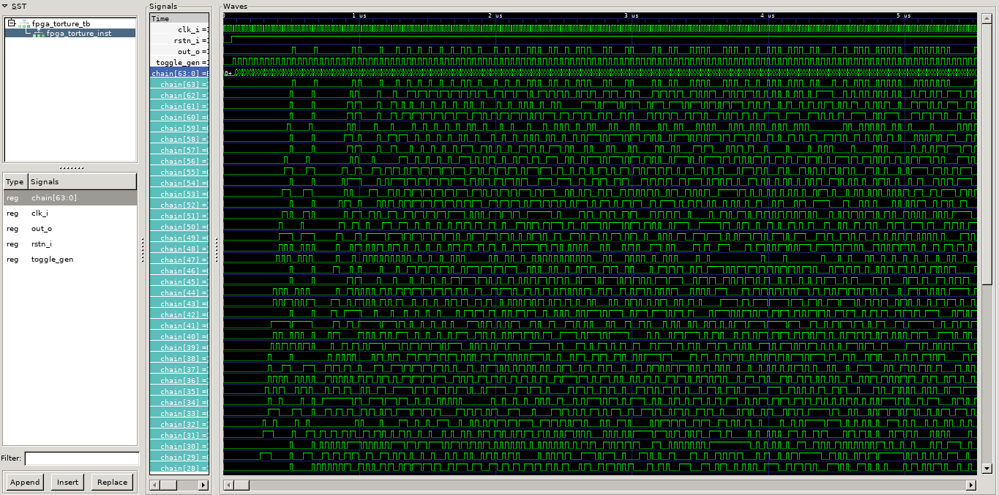

# fpga_torture_ - FPGA Stress-Testing

## * WORK IN PROGRESS * UNDER CONSTRUCTION * KNOWN ISSUES!!!!!!!
> WHILE THIS NOTICE IS PRESENT, DON'T EXPECT DESIGN, SIM, OR ANY OTHER FILE IN HERE 2BE DOIN' WHAT IT'S SAYIN'
## Testing strategy
For best comprehension of the hardware structure we're implementing here visit fpga_torture [repo](https://github.com/stnolting/fpga_torture). Here we'll just cover the basics and the implications regarding the stuff we're on lookout for which is primarily **routing congestion** and **logic capacity**.

This test implements a LUT3+FF chain through a Galois LFSR (Linear-feedback shift register). The LFSR takes 3 DFF outputs, implements a xor on them, and feeds it back to a DFF input. The structure is known to generate a seemingly "random-like" chaotic switching, dissipating maximum dynamic power. 




Now, how does this map to our task of assessing logic capacity and routing capability. Each element instantiated in the LFSR adds a LUT3 and a DFF, so it is a fine-grained structure, and the goal is to fit in as many elements as possible. Theoretically, since the L2T4 elements can do xors on 3 inputs, the limit is around 40k elements instantiated, but some limitations may reduce this number.

The large LSFR chain expresses a **short, local** routing challenge since the signal lines don't traverse more than 3 elements. From the logic capacity point of view, the LUT3s should directly map to L2T4 primitives.  


## Results and analysis
Successful instantiation of 28655 elements at 96.1% utilization is a noteworthy result. A surfacing trend is that the tools and the architecture perform well in short, local routing tasks. This may be a reflection of just the tools capabilities, which is to be verified, but the overall anaysis is laid out [here](https://github.com/chili-chips-ba/openCologne/tree/main/8.StressTest).

As far as the logic capacity goes, **28655 elements** were instantiated at **96.1%** CPE utilization, but the registers remain at 70%. This clearly points that once again we ran out of logic capacity and pushed the CPEs to the limit as in [1.corescore](https://github.com/chili-chips-ba/openCologne/tree/main/8.StressTest/1.corescore_cc). Looking at the logic capacity, we hit the ceiling really fast, once again limited by the number of CPEs. All in all, the number of DFFs seems to be oversized for this number of logic elements, since for even the mostly-sequential circuits we're limited by the logic. 

Another important observation which came as a result of this test is the **Fmax** assessment. The design's critical path consists of only one LUT3, and that lead to a **137 MHz** Fmax. This is the most optimistic case for assesing Fmax, therefore we obtained the absolute maximum frequency that could be run on CCGM1A1. For comparison 


```
Utilization Report

 CPEs                  19689 /  20480  ( 96.1 %)
 -----------------------------------------------
   CPE Registers       28656 /  40960  ( 70.0 %)
     Flip-flops        28656
     Latches               0
```

### Physical testing
There's a PLL running the clock for all of the DFFs at 120 MHz in this design, and the power distribution to the PLL is seemingly getting too hot. Maximum temperature observed was 70 degrees C (even though only 55,5 is shown in the image). Luckily, even at 1.1 V core voltage, at 96.1% utilization and 120 MHz clock the FPGA isn't getting significantly warmer than the room temperature.


## Build steps
This test is written in VHDL as it is ported from the fpga_torture repository, therefore `ghdl` is a prerequisite. Yosys loads in the ghdl module when synthesizing, which is a crucial step and issues may arise if yosys is unable to find the ghdl plugin module. 
```
cd 3.build
make hw_all
```

