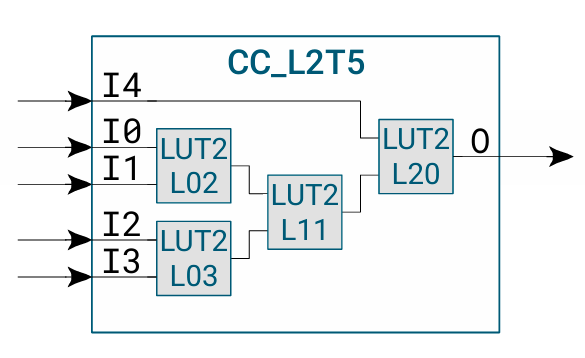

# openCologne
## * WORK IN PROGRESS * UNDER CONSTRUCTION *
> WHILE THIS NOTICE IS PRESENT, DON'T EXPECT DESIGN, SIM, OR ANY OTHER FILE IN HERE 2BE DOIN' WHAT IT'S SAYIN'

<!-- Assess Fmax and realistic utilization, injecting routing congestion and pushing the clock distribution network to its limits. -->

This part is dedicated to assessing the performance (Fmax) and realistic utilization of the Cologne Chip GateMate A1 FPGA by injecting routing congestion and pushing its clock distribution network to the limit.

## Notable Architectural Features

CologneChip's CCGM1A1 employs a peculiar architecture for implementing combinatorial logic, while its routing network remains mostly standard, island-based, with a few twists. Notably, the FPGA does not implement distributed RAM as an integrated primitive but rather emulates it using flip-flops. This unusual characteristic motivated us to conduct benchmarking to observe how these design choices affect performance.

### LUT-tree Logic

The most notable feature of the CCGM1A1 is its LUT-tree logic element for combinatorial logic. Rather than using full LUTs, the design splits them into a tree structure, as illustrated in the figure below. CPE (Cologne Programmable Element) consists of two L2T4 LUT trees instead of standard LUT4s.

There's a trade-off here between using an L2T4 and a LUT4:
- **Less area consumed:** A single L2T4 requires only 12 configuration bits compared to 16 for a LUT4.
- **Reduced combinatorial versatility:** An L2T4 can implement **4,096** different 4-input logic functions, whereas a LUT4 can implement **65,536**.

The two parallel LUT2s generate only 2 bits of intermediate data, which the final LUT2 uses to compute the output. This bottleneck discards critical relationships between the original four inputs. As a consequence, non-decomposable functions can't be implemented in LUT-trees, like:
- **Arbitrary 4-input AND/OR with mixed terms:**
  
  `F(A, B, C, D) = (A∧B) ∨ (C∧D) ∨ (A∧C)`

  This requires cross-coupling between all four inputs, which the parallel LUT2s cannot capture.

- **Complex conditionals:**
  
  `F(A, B, C, D) = (A⊕B) ? (C∨D) : (C∧D)`

  The conditional logic (`A⊕B`) must influence how `C` and `D` are combined, but the rigid partitioning of inputs breaks this dependency.

Due to this structure, there's also a more strict and constricted routing, particularly, when routing  
**Asymmetric Functions**
   - Functions where the output depends **unevenly** on specific inputs (e.g.,  
     `F(A, B, C, D) = A∧B∧(C∨D)`) may fail if the critical inputs (`A` and `B`)  
     are split across the two initial LUT2s.

Laid out hints to a potential cripple in the FPGA's ability to implement all logic. Luckily, for common operations such as addition, multiplication, basic logic functions and multiplexing this choice holds fine. Overall effect on logic capacity is assessed in the benchmark tests.

Mitigating these limits an L2T5 primitive is formed. With the cost of using up the whole CPE, this primitive covers up all the impossible combinations for L2T4, having 4096*16=65536 logic function combinations, a full LUT4! Without a L2T5, some of the logic functions would have to be spread over more CPEs.

Furthermore, combining the two independent L2T4 blocks with one more LUT2, we get an 8-input LUT tree, for a total number of 12+12+4=28 configuration bits bringing the possibility of implementing 40962 logic functions. It's no good for real, 8-input independent variable logic functions, considering the cons of **L2T4 variable splitting**, which amplify in this case.

This feature is still experimental, as the synthesis and PnR tools are not yet suited to accomodate this primitive, as discussed [here](https://github.com/chili-chips-ba/openCologne/issues/28).
### Routing Network Architecture

The FPGA features a standard island-style network architecture, consisting of big and small switch boxes that implement 6 and 2 unidirectional ports, respectively, on each of its NWSE sides. In addition to these Manhattan-style interconnects, diagonal connections are provided to allow signals to traverse several rows and columns more quickly—a useful feature for control logic. It is also worth mentioning that the CPE's input and output muxes supplement this routing network.

## Benchmarks

To unveil the real potential of the CologneChip GateMate A1 FPGA, we ran several benchmark tests targeting different aspects of its performance—often comparing it to similarly sized FPGAs from established vendors. Below is an overview of these benchmarks along with a brief description of their strategies. For detailed instructions and result analysis, please refer to the individual subfolders:

- [Corescore](https://corescore.store) — A popular FPGA benchmark that fits as many [Serv](https://github.com/olofk/serv) cores as possible.
- [LUTRAM_Stress_test](https://github.com/tarik-ibrahimovic/LUTRAM_Stress_Test) — Evaluates the capacity of the emulated distributed asynchronous read RAM, a suspected weak spot.
- [VeerWolves](https://www.linkedin.com/posts/gsteiert_wearealtera-activity-7240773845098323970-Bvlj?utm_source=share&utm_medium=member_desktop) — Similar in concept to Corescore, but with the added challenge of an expanding SOC.
- [fpga_torture](https://github.com/stnolting/fpga_torture) — A combined power and utilization stress test.

## References:
>- https://github.com/mirekez/pnr_tests
   
        - this is a generic Verilog generator
        - by playing with parameters different part of design can be converted to RAM/SRL/DSP blocks
        - also generates XDC to randomly assign pins, this is auxiliary functionality tied to Xilinx and dialects for other vendors can be done

>- https://www.linkedin.com/posts/gsteiert_wearealtera-activity-7240773845098323970-Bvlj?utm_source=share&utm_medium=member_desktop
>- https://github.com/chipsalliance/VeeRwolf/tree/veerwolves
>- https://aignacio.com/posts/hdls/mpsoc_riscv
>- https://github.com/stnolting/fpga_torture
>- https://corescore.store
>- https://gitlab.com/x653/spaceinvaders-fpga

**<h3>  End of Document </h3>**
